# Docker Image Creation and Deployment using Jenkins Pipeline

## Installing Docker


```sh
sudo apt update
sudo apt install -y docker.io
sudo systemctl enable docker --now
docker --version
```
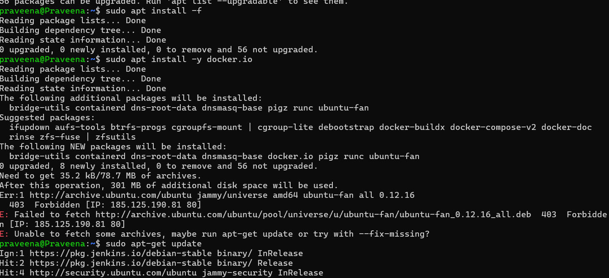


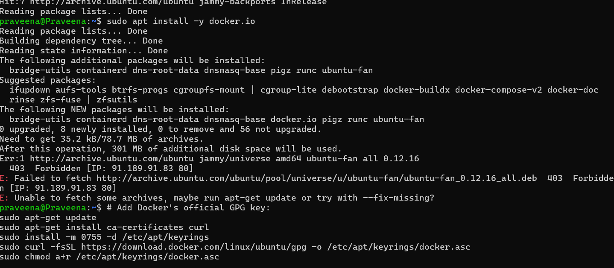


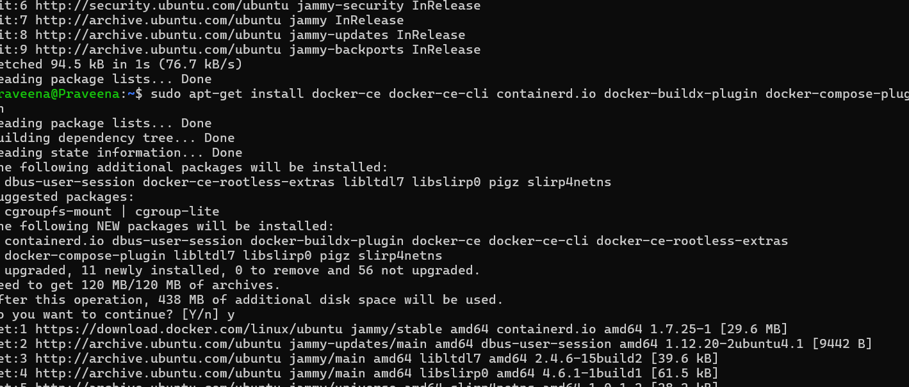


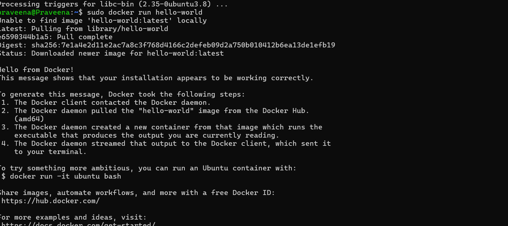


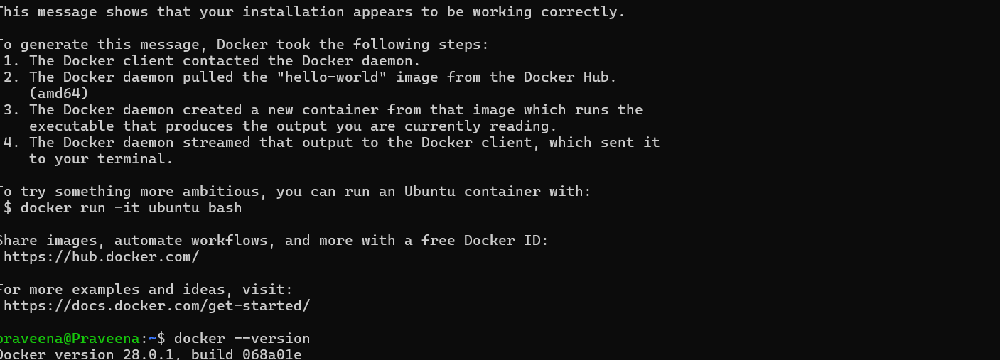
---

## Installing Docker Plugins in Jenkins
1. Go to **Jenkins Dashboard** → **Manage Jenkins** → **Manage Plugins** → **Available Plugins**.
2. Search for and install the following plugins:
   - **Docker**
   - **Docker Commons**
   - **Docker Pipeline**
   - **docker-build-step**
   - **CloudBees Docker Build and Publish**
3. Check the **Restart Jenkins after installation** box to restart Jenkins.
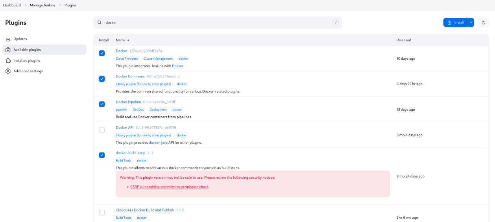
---

## Adding Jenkins to the Docker Group
Run the following commands to allow Jenkins to access Docker:
```sh
sudo usermod -aG docker jenkins
sudo systemctl restart jenkins
sudo reboot
```

---

## Setting Up Docker Credentials in Jenkins
1. Go to **Jenkins** → **Manage Jenkins** → **Credentials** → **System** → **Global Credentials (Unrestricted)** → **Add Credentials**.
2. Enter the following details:
   - **Username**: Your Docker Hub username.
   - **Password**: Your Docker Hub password.
   - **ID**: `docker-seccred`
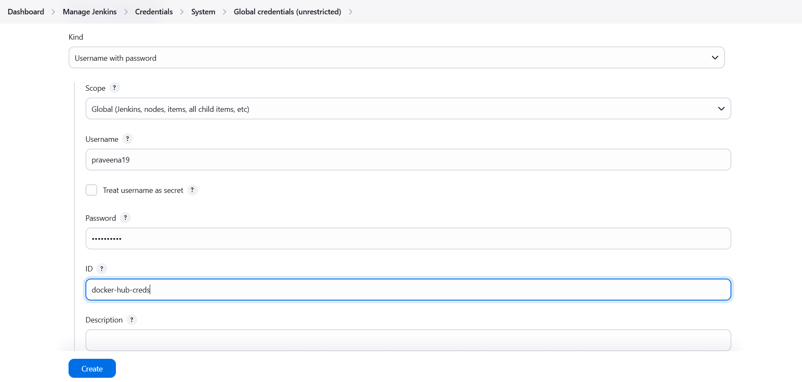
---

## Creating and Building a Pipeline in Jenkins

### Creating a New Pipeline
1. Go to **Jenkins Dashboard** → Click **New Item**.
2. Enter a **Project Name**.
3. Select **Pipeline** and click **OK**.
4. Navigate to the **Pipeline** section.
5. Paste the following Jenkinsfile script, updating it as needed.
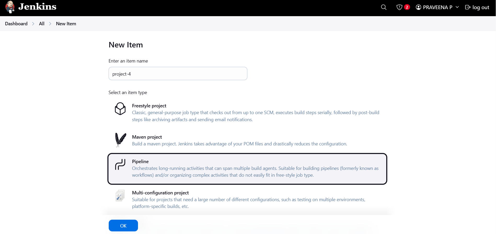

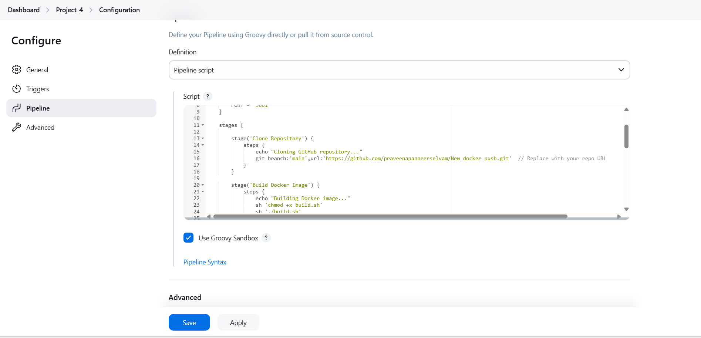

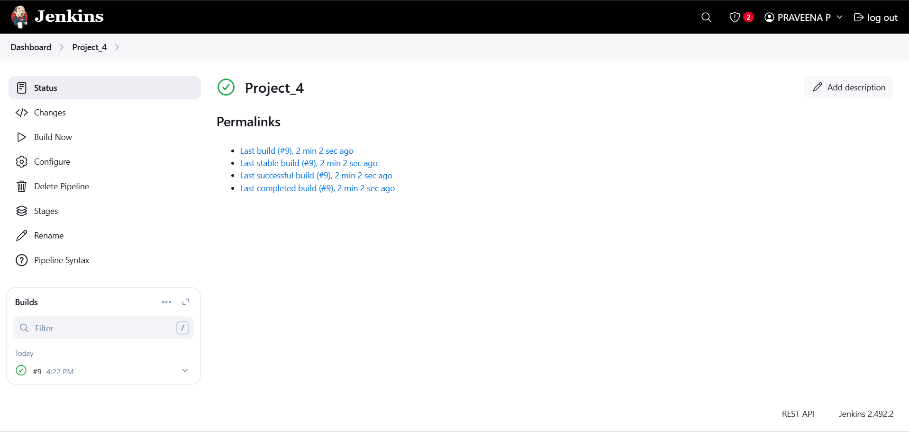
```groovy
pipeline {
    agent any

    environment {
        IMAGE_NAME = "praveena19/devops"          // Replace with your Docker Hub username and image name
        TAG = "latest"
        CONTAINER_NAME = "my-container"
        PORT = "3001"
    }

    stages {
        
        stage('Clone Repository') {
            steps {
                echo "Cloning GitHub repository..."
                git 'https://github.com/praveenapanneerselvam/New_docker_push.git'  // Replace with your repo URL
            }
        }

        stage('Build Docker Image') {
            steps {
                echo "Building Docker image..."
                sh 'chmod +x build.sh'
                sh './build.sh'
            }
        }

                stage('Login to Docker Hub') {
            steps {
                echo "Logging into Docker Hub..."
                withCredentials([usernamePassword(credentialsId: 'docker-hub-creds', usernameVariable: 'DOCKER_USER', passwordVariable: 'DOCKER_PASS')]) {
                    sh 'docker login -u $DOCKER_USER -p $DOCKER_PASS'
                }
            }
        }

        stage('Push Docker Image') {
            steps {
                echo "Pushing Docker image to Docker Hub..."
                sh "docker tag $IMAGE_NAME:$TAG $IMAGE_NAME:$TAG"
                sh "docker push $IMAGE_NAME:$TAG"
            }
        }

        stage('Deploy Docker Container') {
            steps {
                echo "Deploying Docker container..."
                sh 'chmod +x deploy.sh'
                sh './deploy.sh'
            }
        }
    }

    post {
        success {
            echo "Deployment Successful!"
        }
        failure {
            echo "Deployment Failed!"
        }
    }
}
```

6. Click **Save**.
7. Click **Build Now** to start the pipeline.

---

## Verifying Deployment
1. Once the build is successful, visit `http://localhost:3001` in your browser.
2. Ensure the application is running properly.
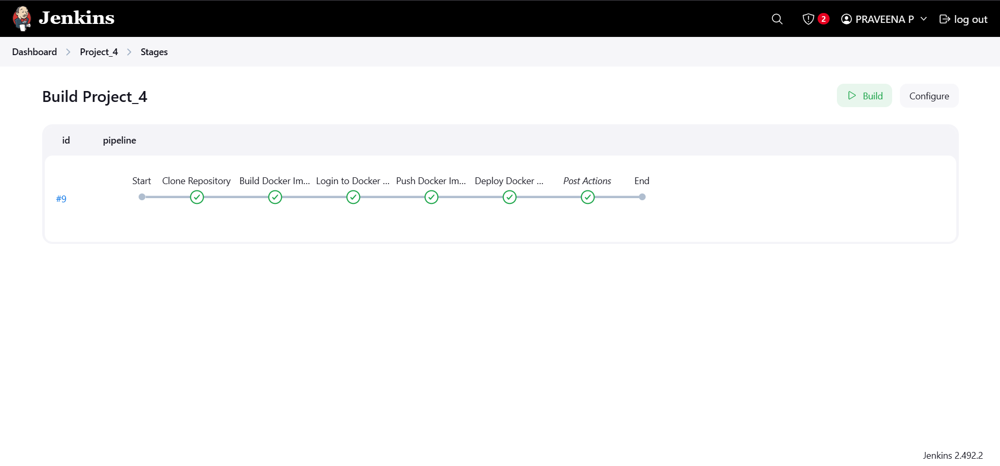
---

## Conclusion
You have successfully set up a Jenkins pipeline to build, push, and deploy a Docker container. 🚀
